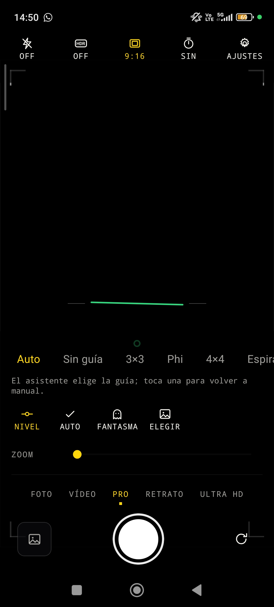
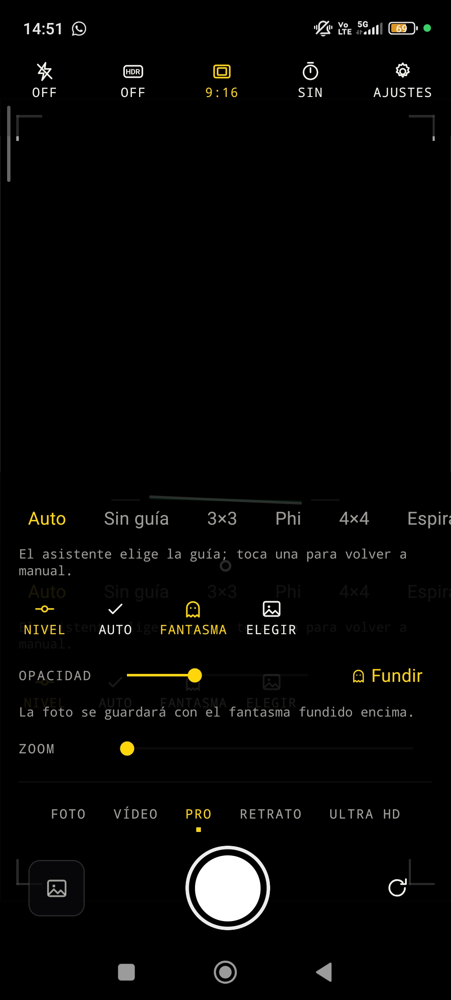
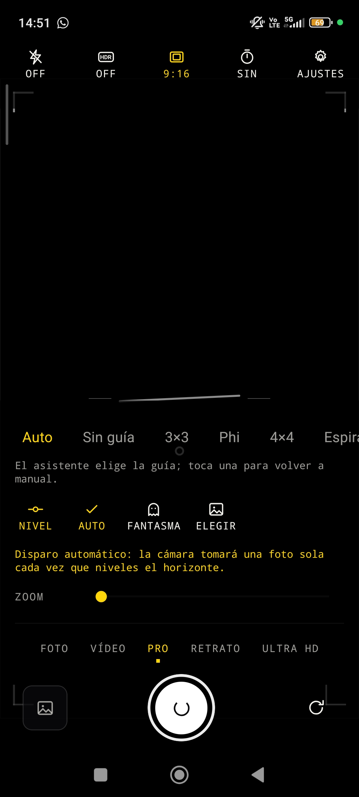

# Cámara PRO (React Native + TypeScript)

App de cámara con guías de composición avanzadas y asistentes en tiempo
real, sobre React Native 0.86 (New Architecture) y TypeScript estricto.

| Visor                                               | Modo fantasma                                         | Disparo automático                                                         |
| --------------------------------------------------- | ----------------------------------------------------- | -------------------------------------------------------------------------- |
|  |  |  |

---

## La app: Cámara PRO

La cámara abre directo al visor, sin login. El modo normal es mínimo
(disparador, flash, voltear, galería); el chip **PRO** despliega las
herramientas avanzadas:

| Herramienta                  | Qué hace                                                                                         |
| ---------------------------- | ------------------------------------------------------------------------------------------------ |
| **Guías de composición**     | 3×3 (tercios), Phi (proporción áurea), 4×4, espiral de Fibonacci, triángulos dorados, simetría   |
| **Máscaras de formato**      | 1:1, 4:5, 9:16, 16:9 y 2.39:1 (cine): sombrean lo que queda fuera sin ocultar la escena          |
| **Nivel giroscópico 2 ejes** | Horizonte artificial con acelerómetro; se pone verde al nivelar (con histéresis anti-parpadeo)   |
| **Disparo automático**       | Dispara solo cuando mantienes el horizonte nivelado ~0.7 s                                       |
| **Modo fantasma**            | Superpone una foto anterior semitransparente; opcionalmente la funde en la captura               |
| **Modo vídeo**               | Graba con el mismo visor y guías; cambia de foto a vídeo sin salir de la pantalla                |
| **Controles manuales PRO**   | ISO, velocidad de obturación, balance de blancos y EV a mano, con vuelta a automático            |
| **Tocar para enfocar**       | Toca el visor para enfocar y exponer ahí (si el sensor lo admite); marco animado de confirmación |
| **Temporizador y zoom**      | 3 s / 10 s con cuenta atrás, zoom continuo                                                       |

Además: galería en cuadrícula de 3 columnas (últimas fotos del carrete),
visor de foto a pantalla completa con "Usar como fantasma", guardado
automático en la galería del sistema y, en Ajustes → **Guía**, un mini
tutorial animado de cada línea guía (toca una tarjeta para ver el ejemplo en
movimiento).

### Las dos caras del modo fantasma

El fantasma nace como **guía de encuadre** (_onion skinning_): ves la foto
anterior translúcida sobre el visor para volver a colocar la cámara en el
mismo sitio, y la foto que disparas sale **limpia**. Es lo que quieres para un
antes/después: dos tomas idénticas de encuadre, ninguna con la otra encima.

Con el chip **«Fundir en la foto»** del panel PRO, la captura se compone con
la superposición a la misma opacidad que ves en pantalla, y lo que se guarda
es la mezcla (doble exposición). El interruptor sólo aparece con el fantasma
activo y se recuerda entre sesiones.

La mezcla la hace `features/camera/utils/ghostCompose.ts` con Skia, sobre los
píxeles reales de la foto y no sobre lo que se ve en pantalla, así que no se
pierde resolución. Si la composición falla, se guarda la toma original: nunca
se pierde la foto.

### Guías: manual y automático

El panel PRO ofrece 15 guías: las clásicas (3×3, Phi, 4×4, espiral, triángulos,
simetría) más las que vienen del asistente de composición (vertical,
horizontal, diagonal, curva en S, centro, patrón, punto de fuga y aire).

El chip **Automático** deja que el asistente elija la guía a partir de lo que
ve la cámara; tocar cualquier guía vuelve a manual sin perder tu elección
anterior. En automático se resalta la que propone el asistente, no la
guardada, para que se vea qué está haciendo.

Dos de las guías (**punto de fuga** y **aire**) están marcadas como no
sugeribles: sus clases nunca llegaron a entrenarse, así que el asistente no
las propondrá nunca, pero se pueden elegir a mano igual que el resto.

El motor vive en `src/features/camera/ai/` (decisión: umbrales, mapeo a guías
e histéresis) y en `android/app/src/main/jni/composition/` (inferencia). La
cadena completa es: 1 de cada 6 fotogramas del visor → `HybridFrameConverter`
lo endereza y lo estira a 224×224 RGB → el motor C++ corre el `.tflite` por
JSI, sin bridge → 14 sigmoides → umbral por clase → la guía se confirma tras
5 análisis seguidos (~1 s) para que no parpadee.

El `.tflite` se empaqueta como asset del APK y lo lee el propio C++ con
`AAssetManager`: JavaScript no toca nunca sus bytes. El archivo sigue viviendo
en `src/features/camera/ai/assets/`, que `android/app/build.gradle` declara
como carpeta de assets del módulo.

**Sólo funciona en Android**, que es el único flujo del proyecto: la
inferencia es C++ propio compilado con la app.

### Las piezas nativas

| Capacidad                | Librería                              |
| ------------------------ | ------------------------------------- |
| Visor y captura          | **react-native-vision-camera** 5      |
| Fotogramas del visor     | react-native-vision-camera-worklets   |
| Inferencia del asistente | C++ propio + TensorFlow Lite (LiteRT) |
| Galería y guardado       | @react-native-camera-roll             |
| Nivel (sensores)         | Reanimated (`useAnimatedSensor`)      |
| Vibración                | `Vibration` de React Native           |
| Fundir el fantasma       | Skia + react-native-nitro-image       |

`features/camera/services/nativeModules.ts` reexporta estas piezas para que el
resto de la feature dependa de un contrato propio en vez de hablar
directamente con cada paquete: cambiar de librería se hace en un solo sitio.

### Hoja de ruta

La canalización de fotogramas del visor ya está montada y en uso por el
asistente de composición (`useCompositionAnalysis`): output de frames de
VisionCamera → worklet → C++ por JSI. Lo que falta se apoya en ella:

- **Focus peaking, patrón zebra e histograma**: son el mismo camino, cambiando
  lo que se hace con el buffer. `useCompositionAnalysis` es el ejemplo a
  copiar; no se simulan con datos falsos.
- **Geometría de la escena en C++** (ángulo del horizonte, dirección de la
  diagonal, cuadrante del sujeto para orientar la espiral): son cálculos de
  visión por computador que la red no resuelve. Van junto al motor, en
  `jni/composition/`. El detalle está en `estructura_cambios.md`.

---

## Puesta en marcha

```bash
npm install          # instala dependencias, aplica los patches y prepara los git hooks
cp .env.example .env # variables de entorno (ver sección Entornos)
```

`npm install` corre `patch-package` solo (hook `postinstall`): aplica los
`.patch` de `patches/` sobre `node_modules` sin tocar nada a mano. Ahí vive
`react-native-vision-camera+5.2.2.patch`, con retoques de Kotlin que la
librería no expone (lectura en vivo de ISO/velocidad/balance de blancos del
3A automático vía `Camera2Interop`, entre otros). Si hace falta tocar ese
código nativo de nuevo:

```bash
# 1. Edita directo en node_modules/react-native-vision-camera/android/...
# 2. Antes de regenerar el patch, borra las cachés de compilación nativa:
#    si se incluyen en el diff lo inflan (a veces varios GB) y pueden agotar
#    el tmpfs de /tmp.
rm -rf node_modules/react-native-vision-camera/android/.gradle \
       node_modules/react-native-vision-camera/android/.cxx \
       node_modules/react-native-vision-camera/android/build
npx patch-package react-native-vision-camera \
  --exclude '(android/\.gradle/|android/build/|android/\.cxx/)'
```

`patches/` **se commitea siempre**: sin eso, un `npm install` en otra máquina
deja el Kotlin de la librería sin los retoques y esas funciones dejan de
compilar o vuelven a su comportamiento por defecto.

El proyecto se compila y se depura siempre como **build nativa**, por cable
USB. No pasa por Expo ni por Expo Go: se quitaron a propósito porque limitan
qué librerías nativas se pueden usar y complican la depuración.

> **Antes de compilar: hace falta JDK 17 o 21, y ninguno más nuevo.**
>
> Con JDK 22 o superior la build muere en `JdkImageTransform`, porque el
> `jlink` de esas versiones no sabe transformar `core-for-system-modules.jar`
> del SDK de Android. El mensaje no dice nada del JDK, así que es fácil
> perder una tarde con él.
>
> Comprueba cuál tienes con `java -version`. Si es más nuevo, instala un
> JDK 21 y apunta Gradle a él **sin tocar el resto del sistema**, en
> `~/.gradle/gradle.properties` (fuera del repo, porque es una ruta local):
>
> ```properties
> org.gradle.java.home=/ruta/a/tu/jdk-21
> ```
>
> También necesitas `ANDROID_HOME` apuntando al SDK y `platform-tools` en el
> `PATH`; si depuras por cable, `adb reverse tcp:8081 tcp:8081` cada vez que
> lo reconectas.

```bash
npm start            # arranca Metro
npm run android      # compila y lanza en Android
npm run ios          # compila y lanza en iOS (sólo macOS)
```

En iOS, la primera vez y cada vez que añadas una librería con código nativo:

```bash
bundle install   # sólo la primera vez
npm run pods
```

En Android basta con volver a ejecutar `npm run android`; el autolinking se
encarga del resto.

### APK que funciona sin el cable

`npm run android` genera una build de **debug**, que no lleva el JavaScript
dentro: se lo pide a Metro por el cable en cada arranque. Para una app que
funcione sola en el teléfono hace falta la de **release**, que empaqueta el
bundle en `assets/index.android.bundle`:

```bash
npm run android:release
```

- `android/app/build.gradle` apunta `entryFile` a `index.ts`. El plugin de
  React Native asume `index.js`, y sin esa línea la build de release falla al
  generar el bundle. En debug no se nota, porque el bundle lo resuelve Metro.
- El release se firma con `debug.keystore` a propósito: sirve para uso
  personal y para pasarle el APK a alguien, **no para Play Store**. Para
  publicar hay que generar un keystore propio y guardarlo fuera del repo
  (`*.keystore` ya está en `.gitignore`); si se pierde, no se pueden volver a
  firmar actualizaciones de esa app.

---

## Estructura

```
src/
├── App.tsx              Raíz de la app
├── providers/           Providers globales (tema, React Query, errores…)
├── components/
│   ├── ui/              Componentes de diseño reutilizables (Button, Text…)
│   └── ErrorBoundary    Captura de errores de render
├── config/              Lectura y validación de variables de entorno
├── features/            ⭐ El código de negocio vive aquí
│   ├── camera/          ⭐⭐ La app de cámara
│   │   ├── ai/          Asistente de composición (modelo, umbrales, mapeo)
│   │   ├── api/         Lectura del carrete (media library)
│   │   ├── components/  Visor, HUD, guías, máscaras, nivel, panel PRO
│   │   ├── constants/   Catálogo de guías, formatos, tolerancias
│   │   ├── hooks/       Permiso, captura, inclinación, temporizador…
│   │   ├── screens/     Cámara, Galería, Visor de foto
│   │   ├── services/    Contrato con las librerías nativas de cámara
│   │   └── utils/       Geometría pura (espiral áurea, máscaras, nivel)
│   ├── auth/            Ejemplo de la plantilla (no montado en la app)
│   ├── posts/           Ejemplo de la plantilla (no montado en la app)
│   └── settings/
├── hooks/               Hooks genéricos reutilizables
├── navigation/          Navegadores, tipos de rutas y deep links
├── services/
│   ├── api/             Cliente HTTP, errores normalizados, React Query
│   └── storage/         AsyncStorage (normal) y Keychain (seguro)
├── store/               Estado global de cliente (Zustand)
├── theme/               Colores, espaciado, tipografía, modo oscuro
└── utils/               Funciones puras (logger, formato)
```

> Los providers globales viven en `src/providers/`, junto al resto de la
> aplicación, para que `src/App.tsx` se quede sólo con la composición.

Hay una segunda mitad fuera de `src/`: el C++ propio del asistente de
composición, en `android/app/src/main/jni/composition/` (motor de inferencia,
lectura del modelo desde los assets y, más adelante, la geometría de las
líneas). `android/app/src/main/jni/CMakeLists.txt` es el del target de la app,
copiado del que React Native esconde en `node_modules` y ampliado para
construir esa biblioteca.

### La regla más importante: _feature-first_

El código se agrupa **por funcionalidad, no por tipo de archivo**. Una pantalla
nueva de "pedidos" crea `src/features/orders/` con sus `api/`, `hooks/`,
`components/` y `screens/` dentro. Así:

- todo lo relacionado se lee junto,
- borrar una funcionalidad es borrar una carpeta,
- dos personas trabajando en features distintas casi nunca chocan.

Sólo sube a `src/components/` o `src/hooks/` lo que **realmente** usen dos o
más features.

### Dirección de las dependencias

```
features/  →  components/, hooks/, services/, store/, theme/, utils/
services/  →  config/, utils/
```

Nunca al revés: `components/` no importa de `features/`, y `services/` no sabe
que existe React. Si necesitas romper esto, casi siempre significa que algo
está en la carpeta equivocada.

---

## Imports absolutos

Configurados en `babel.config.js` y `tsconfig.json`:

```ts
import { Button } from '@/components/ui'; // ✅
import { Button } from '../../../components/ui'; // ❌
```

---

## Entornos

Las variables viven en `.env` (ignorado por git) y se documentan en
`.env.example` (sí commiteado).

> ⚠️ **No son secretos.** `react-native-dotenv` las inyecta en el bundle en
> tiempo de compilación: cualquiera puede leerlas descompilando el APK/IPA.
> Ahí sólo van URLs y flags. Claves de API reales van en tu backend.

Para añadir una variable hay que tocar **tres** sitios:

1. `.env.example` (y tu `.env`) — el plugin corre en modo `safe` y valida
   contra el ejemplo; ninguna puede quedar vacía,
2. `types/env.d.ts` — para que TypeScript la conozca,
3. `src/config/env.ts` — para validarla y convertirla de tipo.

El resto de la app importa siempre `env` desde `@/config/env`, nunca `@env`.

---

## Los dos tipos de estado

Es el error más común al empezar. No los mezcles:

|             | Estado del **servidor**     | Estado del **cliente**   |
| ----------- | --------------------------- | ------------------------ |
| Herramienta | React Query                 | Zustand                  |
| Qué guarda  | Datos que vienen de una API | Sesión, preferencias, UI |
| Dónde       | `features/*/hooks/`         | `src/store/`             |
| Ejemplo     | La lista de publicaciones   | El tema claro/oscuro     |

React Query ya te da caché, `loading`, `error`, revalidación y reintentos:
**no copies datos de la API dentro de un `useState` o de Zustand.**

Regla relacionada: usa el **mínimo** de variables de estado. Si un valor se
puede calcular a partir de otros, calcúlalo durante el render en vez de
guardarlo — el estado duplicado se desincroniza y provoca renders de más.

Las claves de caché se centralizan en `queryKeys`
(`src/services/api/queryClient.ts`) para que una invalidación nunca falle por
un typo.

---

## Almacenamiento: dos cajones, no uno

|            | `storage`                     | `secureStorage`                     |
| ---------- | ----------------------------- | ----------------------------------- |
| Respaldo   | AsyncStorage                  | Keychain (iOS) / Keystore (Android) |
| Cifrado    | ❌ texto plano                | ✅ por el sistema operativo         |
| Qué guarda | Preferencias, flags, caché    | Tokens y credenciales               |
| Archivo    | `services/storage/storage.ts` | `services/storage/secureStorage.ts` |

El token de sesión vive en `secureStorage`, no en AsyncStorage: AsyncStorage
deja el contenido en texto plano dentro del sandbox de la app, y en un
dispositivo con root o jailbreak se lee con un volcado de archivos.

Se conecta al store de auth por la opción `storage` de `persist`:

```ts
storage: createJSONStorage(() => secureStorage);
```

Cada clave se guarda como una entrada independiente del Keychain
(`service: key`) con `WHEN_UNLOCKED_THIS_DEVICE_ONLY`, así que la credencial no
viaja en las copias de seguridad de iCloud y queda atada al dispositivo.

> `secureStorage` **no tiene camino alternativo** a propósito: si el almacén
> seguro falla, registra el error y no guarda nada, en lugar de dejar una
> credencial en texto plano.

---

## Red y errores

`src/services/api/client.ts` expone un único cliente con `baseURL`, timeout,
inyección del token e interceptores. Los features usan el helper `http`:

```ts
export const ordersApi = {
  list: (signal?: AbortSignal) => http.get<Order[]>('/orders', { signal }),
};
```

Cualquier fallo llega a la UI como un `ApiError` con un `kind`
(`network`, `unauthorized`, `server`…) y un mensaje ya presentable. Las
pantallas nunca ven un `AxiosError`, así que cambiar de cliente HTTP no obliga
a tocar componentes.

Un 401 dispara automáticamente el cierre de sesión.

---

## Estilos y tema

Nunca escribas un color a mano. Todo sale de `useTheme()`:

```tsx
import { makeStyles } from '@/theme';

const useStyles = makeStyles(theme => ({
  box: {
    backgroundColor: theme.colors.surface,
    padding: theme.spacing.lg,
    borderRadius: theme.radius.md,
    ...theme.roundedCorner,
    ...theme.elevation.sm,
  },
}));

function MiComponente() {
  const styles = useStyles();
  return <View style={styles.box} />;
}
```

`makeStyles` memoiza la hoja por tema, así que el modo oscuro funciona solo y
no se recrean objetos de estilo en cada render.

Convenciones de estilo aplicadas en la plantilla:

- **`...theme.roundedCorner` siempre junto a `borderRadius`** — aplica
  `borderCurve: 'continuous'`, que suaviza la esquina al estilo iOS.
- **Sombras con `boxShadow`** (sintaxis CSS) en vez de `shadowColor` /
  `elevation`: una sola declaración vale para iOS y Android.
- **`gap` para separar, `padding` para espacio interno.** Nada de `margin` en
  los hijos.
- **Pocos tamaños de fuente.** La jerarquía se hace con peso y color, no
  inventando un `fontSize` nuevo cada vez.

Toda pantalla debe envolverse en `<Screen>`: resuelve de una vez el safe area
(notch, barra de gestos), el color de la status bar y el teclado. Cuando es
scrollable usa `contentInsetAdjustmentBehavior="automatic"`, que deja el
cálculo de insets a la plataforma.

---

## Listas

Usa siempre **FlashList**, incluso para listas cortas: sólo monta los elementos
visibles, mientras que un `ScrollView` con `.map()` los monta todos.

`FeedScreen.tsx` es el ejemplo a copiar. Lo que hay que respetar:

- el componente de cada fila va envuelto en `memo()`,
- `renderItem`, `keyExtractor` y los handlers van en `useCallback`,
- **nada de objetos inline** en `renderItem` (`style={{…}}`, `user={{…}}`):
  crean una referencia nueva en cada render y anulan el `memo()`,
- pide las imágenes al tamaño en que se muestran (×2 para retina), nunca el
  original a resolución completa.

---

## Navegación

Rutas y parámetros se declaran en `src/navigation/types.ts`. A partir de ahí
TypeScript obliga a pasar los parámetros correctos:

```tsx
navigation.navigate('PostDetail', { postId: 42 }); // ✅
navigation.navigate('PostDetail'); // ❌ error de compilación
```

Se usa **native stack** (`@react-navigation/native-stack`), que delega en
`UINavigationController` en iOS y en Fragments en Android: transiciones y
gestos corren en el hilo de UI.

En la app de cámara `RootNavigator` monta el visor como pantalla inicial,
sin login. El flujo de auth del ejemplo (`AuthNavigator` +
`MainTabNavigator`) sigue en el código como referencia del patrón
"protected routes": montar un árbol distinto según el estado de sesión en
lugar de navegar imperativamente, para no dejar pantallas huérfanas en el
historial.

Para navegar desde fuera de React (interceptores, notificaciones push) usa los
helpers de `src/navigation/navigationRef.ts`.

> Los tabs usan `@react-navigation/bottom-tabs`, que es JS. Cambiarlos por
> `react-native-bottom-tabs` (nativos) es un buen upgrade pendiente: se
> sienten mejor y ya no hay nada que lo impida.

---

## Pruebas

```bash
npm test              # una pasada
npm run test:watch    # en modo watch
npm run test:coverage # con reporte de cobertura
```

Los tests van **junto al archivo que prueban** (`Button.tsx` →
`Button.test.tsx`). Usa `renderWithProviders` de `jest/testUtils.tsx` en lugar
del `render` de la librería: ya monta tema, React Query, navegación y safe
area.

> Desde la v14 de `@testing-library/react-native`, `render` y `fireEvent` son
> **asíncronos**: hay que usar `await`.

Los mocks de módulos nativos se registran una sola vez en `jest.setup.ts`.

---

## Calidad de código

```bash
npm run typecheck   # tsc --noEmit
npm run lint        # ESLint, 0 warnings permitidos
npm run lint:fix
npm run format      # Prettier
npm run verify      # typecheck + lint + test  ← ejecuta esto antes de un PR
```

Git hooks (husky), instalados solos con `npm install`:

- **pre-commit** → `lint-staged`: lint + formato sólo de lo que vas a commitear.
- **pre-push** → typecheck + tests afectados.

Reglas destacadas del linter:

- `react/jsx-no-leaked-render`: prohíbe `{count && <Text/>}`. Si `count` vale
  `0`, React Native intenta renderizar el `0` fuera de un `<Text>` y **la app
  crashea en producción**. Usa siempre ternario con `: null`.
- `no-console`: usa `logger` de `@/utils/logger`, que en producción no imprime
  y es donde conectarías Sentry o Crashlytics.
- `import/order`: imports agrupados y ordenados automáticamente.
- `consistent-type-imports`: los tipos se importan con `import type`.

---

## Convenciones

| Elemento      | Convención             | Ejemplo            |
| ------------- | ---------------------- | ------------------ |
| Componentes   | `PascalCase`           | `PostListItem.tsx` |
| Hooks         | `use` + camelCase      | `usePosts.ts`      |
| Stores        | camelCase + `Store`    | `authStore.ts`     |
| Tipos y props | `PascalCase`           | `type ButtonProps` |
| Constantes    | `SCREAMING_SNAKE_CASE` | `MIN_TOUCH_SIZE`   |
| Tests         | junto al archivo       | `Button.test.tsx`  |

Checklist para toda pantalla que cargue datos — maneja los **cuatro** estados:

1. cargando (`<Loader />`),
2. error (`<StateView tone="error" />` con reintento),
3. vacío (`ListEmptyComponent`),
4. con datos.

`FeedScreen.tsx` es el ejemplo a copiar.

Otras dos reglas que ahorran dolores de cabeza:

- **Los objetos `Intl` se crean una sola vez**, a nivel de módulo. Instanciarlos
  es caro (parsean datos de locale). Ver `src/utils/format.ts`.
- **Importa desde el design system, no desde el paquete.** Usa `Image` y `Text`
  de `@/components/ui`, no de `react-native`: cambiar la implementación de todas
  las imágenes de la app pasa a ser tocar un archivo.

---

## Comandos útiles

```bash
npm run start:reset    # Metro limpiando caché
npm run clean:metro    # borra caché de Metro y watchman
npm run clean:android  # gradlew clean
npm run android:release  # APK autónomo, sin cable
npm run ios:release
```

---

## Cosas que querrás añadir

- **Iconos**: `react-native-vector-icons` (los tabs usan emoji a propósito).
- **Tabs nativos**: `react-native-bottom-tabs`.
- **Monitoreo**: Sentry o Crashlytics, conectados dentro de `logger.error`.
- **i18n**: `i18next` + `react-i18next` si necesitas más de un idioma.

Ya instaladas y en uso: **Reanimated** (para los sensores del nivel; anima
sólo `transform` y `opacity`, que corren en la GPU) y **Skia** (para fundir el
fantasma en la foto).

Al añadir cualquier librería con código nativo hay que **recompilar**
(`npm run android`, o `npm run pods && npm run ios`): recargar Metro no basta.
